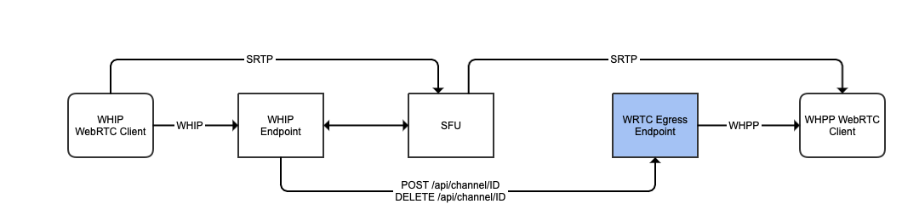

# Standardized WebRTC Egress Endpoint Library

[](https://opensource.org/licenses/MIT) [](http://slack.streamingtech.se)

Server endpoint for standardized WebRTC based streaming. Currently supports the following egress / playback protocol:
- WHPP: [WebRTC HTTP Playback Protocol](https://github.com/Eyevinn/webrtc-http-playback-protocol/blob/master/webrtc-http-playback-protocol.md)
- WHEP: [WebRTC HTTP Egress Protocol](https://datatracker.ietf.org/doc/draft-murillo-whep/)

And support for the following SFUs:
- Symphony Media Bridge (`SfuType.smb`)



## Usage

Install library

```
npm install --save @eyevinn/wrtc-egress
```

### WHPP Example

Use WHPP as egress protocol and Symphony Media Bridge as SFU.

```javascript
import { WHPPEndpoint, SfuType } from "@eyevinn/wrtc-egress";

const endpoint = new WHPPEndpoint({
  port: 8001,
  hostname: "wrtc-edge.eyevinn.technology",
  prefix: "/whpp",
  sfuAdapter: SfuType.smb,
  sfuOptions: { smbUrl: "http://localhost:8080/conferences/", apiKey: "secret" },
  iceServers: [{ urls: "stun:stun.l.google.com:19302" }],
});
endpoint.listen();
```

When running an HTTP API for managing the channel is available at `/api/channels` by default. 

Access to WHPP endpoint at `/whpp/channels`.

### WHEP Example

Use WHEP as egress protocol and Symphony Media Bridge as SFU.

```javascript
import { WHEPEndpoint, SfuType } from "@eyevinn/wrtc-egress";

const endpoint = new WHEPEndpoint({
  port: 8001,
  hostname: "wrtc-edge.eyevinn.technology",
  prefix: "/whep",
  sfuAdapter: SfuType.smb,
  sfuOptions: { smbUrl: "http://localhost:8080/conferences/", apiKey: "secret" },
  iceServers: [{ urls: "stun:stun.l.google.com:19302" }],
});
endpoint.listen();
```

Access to WHEP endpoint at `/whep/channels`.

## API

| Resource  | HTTP Method | Description |
| --------  | ------ | ----------- |
| `/api/docs` | GET | Online API docs |
| `/api/channels/:channelId` | POST | Create a new channel |
| `/api/channels/:channelId` | DELETE | Delete a channel |

## Local Development

To develop locally a `docker-compose` config exists that spins up a WHIP-endpoint and origin + egress SFU.

```
docker-compose up
```

Then run the egress endpoint in developer mode:

```
npm run dev
```

If you don't have a WHIP stream you can go to https://web.whip.eyevinn.technology and enter this endpoint URL: [http://localhost:8200/api/v2/whip/sfu-broadcaster?channelId=test](https://web.whip.eyevinn.technology/?endpoint=http%3A%2F%2Flocalhost%3A8200%2Fapi%2Fv2%2Fwhip%2Fsfu-broadcaster%3FchannelId%3Dtest)

To try playback with for example WHEP you can open a browser at https://webrtc.player.eyevinn.technology and enter `http://localhost:8001/whep/channel/test` as WHEP url.

Or for WHEP in a similar way https://webrtc.player.eyevinn.technology/?type=whep and enter `http://localhost:8001/whep/channel/test` as WHEP url.

## Support

Join our [community on Slack](http://slack.streamingtech.se) where you can post any questions regarding any of our open source projects. If you fancy any help in enhancing or integrating this component just drop an email to sales@eyevinn.se and we'll figure something out together.

## About Eyevinn Technology

[Eyevinn Technology](https://www.eyevinntechnology.se) is an independent consultant firm specialized in video and streaming. Independent in a way that we are not commercially tied to any platform or technology vendor. As our way to innovate and push the industry forward we develop proof-of-concepts and tools. The things we learn and the code we write we share with the industry in [blogs](https://dev.to/video) and by open sourcing the code we have written.

Want to know more about Eyevinn and how it is to work here. Contact us at work@eyevinn.se!